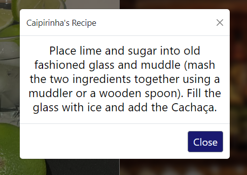

# The Cocktail Finder
## Outil pour trouver des idées et des recettes de cocktails


Le site s'articule autour de trois fonctionnalités :<br> 
    - chercher un cocktail pour obtenir ses ingrédients et sa recette<br>
    - proposer un cocktail aléatoire, en obtenant également ses ingrédients et sa recette<br>
    - proposer des cocktails à partir d'un ingrédient entré par l'utilisateur<br>

<br>

## Rechercher un cocktail

Pour rechercher un cocktail il suffit de taper son nom (en anglais) puis de cliquer sur "Browse". Si le cocktail existe dans la base de données, une carte apparaitre alors avec la photo du cocktail, son nom, ses ingrédients ainsi qu'un bouton permettant d'afficher sa recette. <br>


Si le nom tapé n'est pas trouvé dans la base de donnée, alors un message d'erreur s'affiche.<br>


Si votre recherche a donné un résultat, vous pouvez alors cliquer sur le bouton "Show Recipe" pour que la recette du cocktail en question vous soit donnée. Cette dernière apparaitra via un message, au milieu en haut de votre écran. 


<br>

## Générer un cocktail aléatoire

Cette fonctionnalité reprend les principes de la recherche par nom pour ce qui est de l'affichage du résultat et de la recette.<br>
Il suffit ici de cliquer sur le bouton "Suggest a Random Cocktail" et une card apparaitra alors, exactement comme vu précédemment.<br>
La différence est que le cocktail affiché sera aléatoirement choisi, le but étant de faire découvrir des nouveautés à l'utilisateur. 


<br>

## Proposer des cocktails selon un ingrédient

Cette fonctionnalité permet de proposer aléatoirement des cocktails en y intégrant une condition : un ingrédient des cocktails est choisi à l'avance par l'utilisateur.

Cette fonctionnalité permet de se voir proposer 4 cocktails comprenant l'ingrédient tapé par l'utilisateur, lui permettant ainsi d'affiner la proposition de cocktails en fonction de ses envies.


<br>

## Section Favoris

Cette section, qui n'est pas interractive, a pour but d'etoffer quelque peu le site en y intégrant du contenu statique pour qu'il n'ait pas l'air "vide" lorsque l'on arrive sur la page et que l'on n'a donc pas encore effectué de recherche.<br>

<br>

## Concernant l'esthétique du site

Pour ce qui est de l'esthétique du site, une grande partie est réalisée grâce à Bootstrap, qui a l'avantage d'avoir de nombreux modules préfaits, permettant de se concentrer sur l'ajout de fonctionnalités plutôt que sur la réalisation visuelle.<br>
Je fais notamment référence ici aux "cards" dont je me sers pour la partie recherche de cocktail et proposition aléatoire, mais aussi pour les champs de texte à taper et les boutons, bien que ces derniers aient été quelques peu retouchés via le CSS.

Le CSS sert donc pour cette page à la personnalisation du texte, à l'arrière plan, ainsi qu'aux formes des images de cocktails se trouvant dans la section favoris.

<br>

## Sur le plan technique

Pour ce qui est de la partie technique, on va utiliser pour l'API disponible sur le site <a href="https://www.thecocktaildb.com/api.php">TheCocktailDB</a> disponible à l'adresse suivante : 
```
https://www.thecocktaildb.com/api.php
```

Le site nous permet directement de générer un cocktail aléatoire, de filtrer par ingrédient, ou de chercher un cocktail via son nom. <br>
Nous allons donc utiliser ces différentes possibilités via notre Javascript en fonction de la fonctionnalité sur laquelle nous travaillerons. 
Il nous faudra ensuite récupérer les éléments dont nous avons besoin dans les résultats de nos requêtes. 
```JS
function fetchCocktail(){
        return fetch('https://www.thecocktaildb.com/api/json/v1/1/random.php')
    }
    const cocktail = fetchCocktail()
    .then((httpResponse) => {
        return httpResponse.json()
    }).then ((randomCocktail)=> {
            myCocktailName.textContent = randomCocktail.drinks[0].strDrink 
            myPicture.src = randomCocktail.drinks[0].strDrinkThumb
    })
```
Cet extrait de code illustre par exemple comment nous allons générer un cocktail aléatoire et récupérer son nom et l'image qui lui correspond.<br>
Pour plus de détails, vous pouvez directement consulter la page "script.js" commentée.

Les éléments que nous chercherons à récupérer lors de nos requêtes seront :<br>
-Le nom<br>
-Les ingrédients<br>
-L'image<br>
-La recette<br>

<br>

Concernant les sections de recherche par ingrédient et favoris, le choix a été fait de ne pas rendre cliquable les images afin d'obtenir les ingrédients et la recette.<br>
La raison est que cela n'apportait aucune nouveauté sur le plan technique par rapport aux éléments déjà développés dans la section de recherche par nom et de génération aléatoire.<br>
Ce projet ayant avant tout un but scolaire et donc éducatif, le choix a été fait de se concentrer sur les éléments nécessitant de nouvelles compétences plutôt que de simplement décliner plusieurs fois la même fonctionalité.
